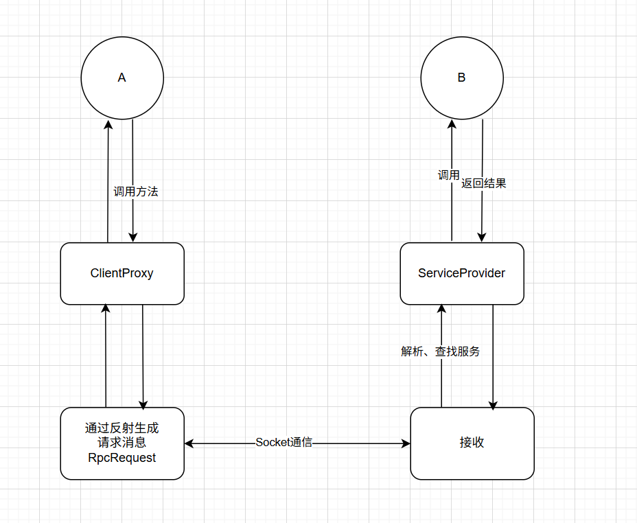

> 用于记录进行该项目的进度、问题、思考等，算是学习笔记吧

## Day 1

初步开始RPC项目的编写，主要是学习了前置基础知识
学完zookeeper再来继续敲代码

借今天的学习学到了建造者模式，学习了zkp，算是有点收获。

## Day 2

实现了基本的rpc调用

遇到的问题有：
RpcReq/Res无法序列化——没有实现Serializable接口(好蠢的错误)

进一步熟悉了Java反射、代理技术
学习了解了netty相关内容

Q：ClientProxy中使用`method.getDeclaringClass().getName()`而不是`proxy.getClass().getName()`
A：
- 代理对象的类名不是接口名：proxy 是 JDK 动态代理生成的代理对象，其类名类似 com.sun.proxy.$Proxy0，不是接口名
- 在 RPC 中，客户端只持有接口服务端根据接口名查找实现
- method.getDeclaringClass()返回声明该方法的类，在接口代理场景下就是接口本身

## Day 3

引入netty高性能网络框架，优化客户端和服务端的网络传输，取代原有的原生Socket编程
进一步了解了netty相关技术

netty的优势：
- io传输由BIO ->NIO模式；底层使用池化技术复用资源
- 可以自主编写 编码/解码器，序列化器等等，可拓展性和灵活性高
- 支持TCP,UDP多种传输协议；支持堵塞返回和异步返回
- ......

netty执行流程
客户端调用RpcClient.sendRequest方法 --->NettyClientInitializer-->Encoder编码 --->发送
服务端RpcServer接收--->NettyServerInitializer-->Decoder解码--->NettyRPCServerHandler ---->getResponse调用---> 返回结果
客户端接收--->NettyServerInitializer-->Decoder解码--->NettyRPCServerHandler处理结果并返回给上层