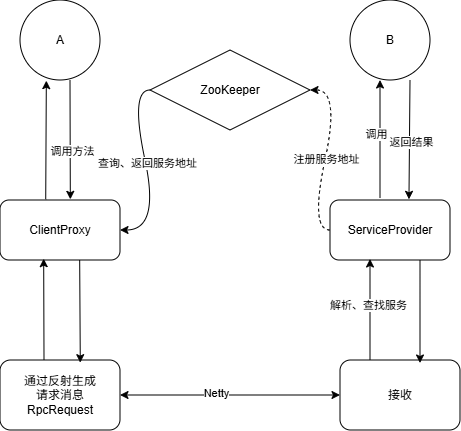

> 用于记录进行该项目的进度、问题、思考等，算是学习笔记吧

## Day 1

初步开始RPC项目的编写，主要是学习了前置基础知识
学完zookeeper再来继续敲代码

借今天的学习学到了建造者模式，学习了zkp，算是有点收获。

## Day 2

实现了基本的rpc调用

遇到的问题有：
RpcReq/Res无法序列化——没有实现Serializable接口(好蠢的错误)

进一步熟悉了Java反射、代理技术
学习了解了netty相关内容

Q：ClientProxy中使用 `method.getDeclaringClass().getName()`而不是 `proxy.getClass().getName()`

A：

- 代理对象的类名不是接口名：proxy 是 JDK 动态代理生成的代理对象，其类名类似 com.sun.proxy.$Proxy0，不是接口名
- 在 RPC 中，客户端只持有接口服务端根据接口名查找实现
- method.getDeclaringClass()返回声明该方法的类，在接口代理场景下就是接口本身

## Day 3

引入netty高性能网络框架，优化客户端和服务端的网络传输，取代原有的原生Socket编程
进一步了解了netty相关技术

netty的优势：

- io传输由BIO ->NIO模式；底层使用池化技术复用资源
- 可以自主编写 编码/解码器，序列化器等等，可拓展性和灵活性高
- 支持TCP,UDP多种传输协议；支持堵塞返回和异步返回
- ......

netty执行流程：

- 客户端调用RpcClient.sendRequest方法 --->NettyClientInitializer-->Encoder编码 --->发送
- 服务端RpcServer接收--->NettyServerInitializer-->Decoder解码--->NettyRPCServerHandler ---->getResponse调用---> 返回结果
- 客户端接收--->NettyServerInitializer-->Decoder解码--->NettyRPCServerHandler处理结果并返回给上层

## Day 4

引入Zookeeper作为注册中心：
现有的实现下，调用服务时，目标的ip地址和端口port都是写死的，默认本机地址和9999端口号
在实际场景下，服务的地址和端口会被记录到【注册中心】中。服务端上线时，在注册中心注册自己的服务与对应的地址，而客户端调用服务时，去注册中心根据服务名找到对应的服务端地址。

客户端新增了ServiceCenter的接口和ZKServiceCenter的实现
服务端改动了注册服务相关的功能

**Zookeeper的作用和角色：**

Zookeeper承担**服务注册中心（Service Registry）**的角色，主要负责：

1. **服务注册（服务端）**：

   - 服务端启动时，通过 `ZKServiceRegister`将服务名和服务器地址注册到Zookeeper
   - 创建永久节点 `/MyRPC/{serviceName}`存储服务名
   - 创建临时节点 `/MyRPC/{serviceName}/{host:port}`存储服务地址（临时节点会在服务下线时自动删除，实现服务状态感知）
2. **服务发现（客户端）**：

   - 客户端调用服务时，通过 `ZKServiceCenter`根据服务名查询Zookeeper获取服务地址
   - 客户端不再需要硬编码服务地址，实现了服务地址的动态获取和解耦
3. **解决的问题**：

   - **解耦**：客户端和服务端不需要知道对方的具体地址
   - **动态性**：服务地址可以动态变化，客户端能够自动发现新的服务实例
   - **高可用**：支持多个服务实例，服务端下线时临时节点自动删除，客户端能感知服务状态

**梳理一下整个请求发起、执行、返回的流程**

> 前提：对客户端来说 远程服务是透明的 它就认为是调用了本地的方法（这里是UserService）并得到了结果

1. 客户端调用某个方法(通过代理对象 但是客户端当成实际对象使用)
2. 代理对象会代理这个方法的执行，先构建一个RpcRequest对象 然后使用RpcClient(这里是 `NettyRpcClient`)发起一次远程调用(全过程对客户端无感)
3. RpcClient会从服务中心(目前使用的是ZKP)获取到要调用的方法的host和port 然后底层使用Netty和服务端建立连接并发送request
4. 服务器接收到request 交给NettyHandler处理 某个handler(这里是 `NettyRPCServerHandler`)会处理这个request请求 反射调用对应方法并返回结果response
5. 客户端的RpcClient(这里还是 `NettyRpcClient`)接收到response之后会拆解还原 返回最终的数据给客户端

**服务器的启动、服务注册、监听流程**

1. 创建服务实现类的实例(这里是 `UserServiceImpl`) 然后创建 `ServiceProvider`对象并传入服务器地址和端口
2. 调用 `ServiceProvider`的 `provideServiceInterface`方法注册服务接口 该方法会将服务接口名和实例映射关系存储到本地 `interfaceProvider`中 同时通过 `ZKServiceRegister`将服务注册到 `Zookeeper`注册中心(创建永久节点/MyRPC/{serviceName}和临时节点/MyRPC/{serviceName}/{host:port})
3. 创建 `NettyRPCServer`实例 传入 `ServiceProvider `然后调用start方法启动服务器监听指定端口
4. `NettyRPCServer`启动时会创建 `bossGroup`和 `workGroup`线程组 配置 `ServerBootstrap`并初始化管道处理器链(包括 `LengthFieldBasedFrameDecoder`解码、`LengthFieldPrepender`编码、`ObjectEncoder`序列化、`ObjectDecoder`反序列化、`NettyRPCServerHandler`业务处理) 最后绑定端口并阻塞监听
5. 当接收到客户端请求时 `NettyRPCServerHandler`会从 `ServiceProvider`获取对应的服务实例 通过反射调用服务方法并封装结果返回给客户端

当前架构：

## Day 5

> ChannelHandler 是对 Channel 中数据的处理器，这些处理器可以是系统本身定义好的编解码器，也可以是用户自定义的。这些处理器会被统一添加到一个 ChannelPipeline 的对象中，然后按照添加的类别对 Channel 中的数据进行依次处理。
实现了自定义编解码器
- encoder 加工出一条字节数组
- decoder 读取字节数组，获得里面的对象
这么做：
- 将编码解码的过程进行封装，代码变得简洁易读，维护更加方便 
- 在内部实现消息头的加工，解决沾包问题 
- 消息头中加入messageType消息类型，对消息的读取机制有了进一步的拓展

自定义序列化器
- 将序列化任务和其他功能模块解耦，只需要在Netty初始化时指定对应的序列化器
- 解决“反序列化类型不准”的问题：在序列化器中做类型修正
- 便于后续拓展（改动序列化器即可）

在客户端引入可动态更新的本地缓存
原先的实现，每次调用服务都要去注册中心（zookeeper）查找地址，性能很差（40s+每千次）
加入缓存后，调用服务首先读取本地缓存，未命中才去注册中心查找
本地缓存的实现在旁路缓存策略上做了增强
- 用以解决注册中心和本地缓存的不一致性（比如注册中心新注册了一个服务节点）
- 在注册中心注册Watcher，监听注册中心的变化，实现本地缓存的动态更新

zookeeper事件监听机制

**watcher概念**

- zookeeper提供了数据的发布/订阅功能，多个订阅者可同时监听某一特定主题对象，当该主题对象的自身状态发生变化时例如节点内容改变、节点下的子节点列表改变等，会实时、主动通知所有订阅者 
- zookeeper采用了 Watcher机制实现数据的发布订阅功能。该机制在被订阅对象发生变化时会异步通知客户端，因此客户端不必在 Watcher注册后轮询阻塞，从而减轻了客户端压力 
- watcher机制事件上与观察者模式类似，也可看作是一种观察者模式在分布式场景下的实现方式

**watcher架构**
watcher实现由三个部分组成： 
- zookeeper服务端 
- zookeeper客户端 
- 客户端的ZKWatchManager对象
> 客户端首先将 Watcher注册到服务端，同时将 Watcher对象保存到客户端的watch管理器中。当Zookeeper服务端监听的数据状态发生变化时，服务端会主动通知客户端，接着客户端的 Watch管理器会**触发相关 Watcher**来回调相应处理逻辑，从而完成整体的数据 发布/订阅流程